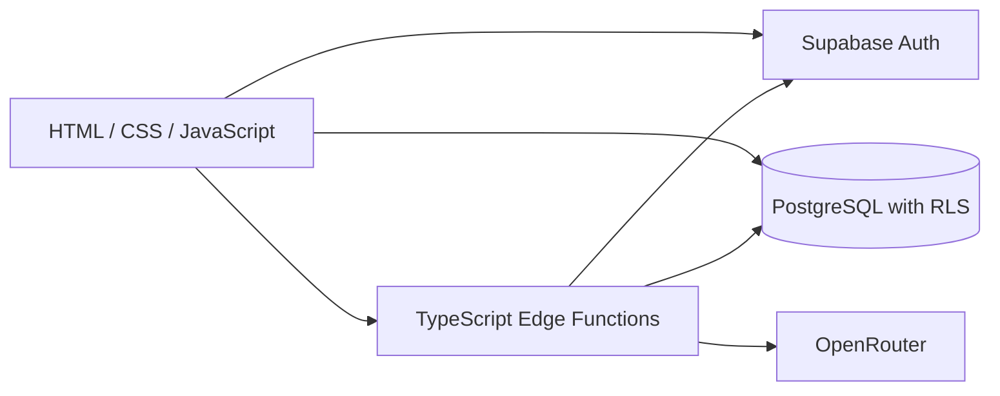

# CampusFlow

CampusFlow helps students turn course materials into organized summaries, practice quizzes, and study conversations. Users can save their results and return to them across sessions.

A static JavaScript frontend connects to Supabase Auth, PostgreSQL, and TypeScript Edge Functions. AI generation runs through OpenRouter on the backend.

## Contents

- [Features](#features)
- [Architecture](#architecture)
- [Technology stack](#technology-stack)
- [Project structure](#project-structure)
- [AI usage controls](#ai-usage-controls)
- [Getting started](#getting-started)
- [Backend setup](#backend-setup)
- [Frontend deployment](#frontend-deployment)
- [Testing](#testing)
- [Known limitations](#known-limitations)
- [Troubleshooting](#troubleshooting)

## Features

- Analyze PDF, TXT, and CSV files and group related materials by course.
- Extract course topics, schedules, deadlines, and important policies.
- Save course summaries to a personal dashboard.
- Generate practice quizzes, save answers, and request explanations for incorrect answers.
- Ask follow-up study questions and reopen saved conversations.
- Authenticate users and scope saved records to their owners through Row Level Security policies.
- Limit AI usage across both endpoints with shared quotas, timeouts, and retry budgets.
- Show actionable failure messages without displaying raw backend diagnostics in the interface.

## Architecture



The browser sends documents and study context to the Edge Functions. Each function verifies the user's token with Supabase Auth, validates the request, and reserves an AI task through PostgreSQL before contacting the provider. Generated output is parsed and validated; incomplete responses may be repaired within the same call and time budget. The browser saves accepted results using the signed-in user's permissions.

Uploaded documents and study context are sent to OpenRouter for processing. Provider credentials and privileged database credentials remain on the backend.

### Data storage

| Table | Purpose |
| --- | --- |
| `saved_courses` | Course summaries, schedules, and important details |
| `saved_quizzes` | Generated questions and saved answers |
| `saved_conversations` | Study conversation history |
| `feedback_requests` | Visitor feedback with insert-only browser permissions |
| `ai_usage_settings` | Per-minute, daily, and concurrent AI limits |
| `ai_usage_accounts` | Per-user locks for transactional task admission |
| `ai_usage_tasks` | Usage history and expiring concurrency leases |

## Technology stack

| Layer | Technologies |
| --- | --- |
| Frontend | HTML, CSS, vanilla JavaScript, Lucide icons |
| Authentication | Supabase Auth |
| Database | PostgreSQL, SQL migrations, Row Level Security |
| Backend | TypeScript, Supabase Edge Functions, Deno |
| AI provider | OpenRouter |
| Automated tests | Node.js test runner and PGlite PostgreSQL integration tests |
| Optional browser tests | Playwright and Chromium |
| Local server | Node.js built-in HTTP server |

## Project structure

```text
CampusFlow/
├── index.html
├── sign_in.html / sign_in.js
├── sign_up.html / sign_up.js
├── main.css
├── study.css
├── script.js
├── supabase-config.js
├── favicon.svg
├── package.json
├── package-lock.json
├── demo/materials/                 # Fictional course documents
├── supabase/
│   ├── functions/
│   │   ├── analyze-course-file/index.ts
│   │   ├── study-assistant/index.ts
│   │   └── _shared/                # Reusable authentication and AI helpers
│   └── migrations/                 # Database schema and permissions
├── tests/                          # Backend, SQL, error-message, and browser tests
└── tools/                          # Local server, deployment, and verification tools
```

## AI usage controls

Both AI endpoints share limits for the verified user:

| Control | Default | Configuration |
| --- | --- | --- |
| Accepted tasks in a rolling minute | 6 | `ai_usage_settings.requests_per_minute` |
| Accepted tasks per UTC day | 50 | `ai_usage_settings.requests_per_day` |
| Concurrent tasks | 2 | `ai_usage_settings.max_concurrent` |
| Total AI generation time | 90 seconds | `AI_TASK_TIMEOUT_MS` |
| Each provider call, including response reading | 30 seconds | `AI_ATTEMPT_TIMEOUT_MS` |
| Provider calls per task, including retries and repair | 4 | `AI_MAX_PROVIDER_CALLS` |

Task admission locks one database row per user, checks all quotas, and reserves a slot in a transaction. The lock is released before AI generation. Browser roles cannot change quotas or invoke the reservation and completion functions.

Accepted tasks count toward usage even when generation fails. Invalid and quota-rejected requests do not consume a task. Completion releases concurrent capacity without refunding usage. An expiring lease recovers the slot if a worker or cleanup call fails; the default lease lasts 110 seconds.

Quota denials return HTTP `429` with a retry interval; total AI timeout returns `504`. Provider failures and retry exhaustion stop the task. Quota-service failures also stop generation rather than bypassing limits. These controls limit requests and provider calls; they do not impose a monetary spending cap.

Project owners can change quotas through SQL:

```sql
update public.ai_usage_settings
set requests_per_minute = 6,
    requests_per_day = 50,
    max_concurrent = 2
where id = true;
```

Optional generation settings accept a total timeout of 15–120 seconds, a provider timeout of 1–60 seconds no greater than the total timeout, and 1–8 provider calls. Authentication and quota RPCs have separate eight-second timeouts.

## Getting started

Requirements:

- Node.js 24.20.0 or later within the Node 24 release line.
- A Supabase project and an OpenRouter account for backend features.
- Internet access for the backend and browser libraries loaded from CDNs.

From the project directory:

```sh
npm ci
npm start
```

Open [http://localhost:5500](http://localhost:5500). Stop the server with Ctrl+C.

The local server exposes only the frontend assets. It does not create a local database or start the Edge Functions. Configure your backend using the steps below; the supplied frontend configuration points to an existing hosted project. Use your own development project for experiments.

Fictional TXT documents for a walkthrough are included in `demo/materials`.

## Backend setup

### 1. Configure Supabase

Create or select a Supabase project. Replace only the configuration object in `supabase-config.js`, preserving the client initialization code below it:

```js
window.SUPABASE_CONFIG = {
    url: "YOUR_SUPABASE_PROJECT_URL",
    publishableKey: "YOUR_SUPABASE_PUBLISHABLE_KEY"
};
```

The project URL and browser publishable key are public configuration. Keep OpenRouter keys, service-role keys, secret keys, and login tokens out of browser code and source control.

### 2. Apply database migrations

For a new database, run the SQL files in `supabase/migrations` in this order, using the Supabase SQL editor or your migration workflow:

1. `20260924_create_saved_courses.sql`
2. `20261001_create_saved_quizzes.sql`
3. `20261004_create_saved_conversations.sql`
4. `20261005_create_feedback_requests.sql`
5. `20261006_add_ai_usage_controls.sql`

For an existing database, apply only missing migrations. Earlier migrations create named policies and should not be blindly rerun. The AI quota migration is repeatable and preserves existing settings and history. Apply it before deploying handlers that require the quota RPCs.

### 3. Configure backend environment variables

| Variable | Purpose |
| --- | --- |
| `OPENROUTER_API_KEY` | Server-side OpenRouter credential |
| `OPENROUTER_MODEL` | Optional model ID; defaults to `openrouter/free` |
| `CAMPUSFLOW_PUBLISHABLE_KEY` | Browser publishable key for the same Supabase project, used to verify user sessions |
| `ALLOWED_ORIGIN` | Exact allowed frontend origin, such as `http://localhost:5500` |
| `AI_TASK_TIMEOUT_MS` | Optional generation timeout; default `90000` |
| `AI_ATTEMPT_TIMEOUT_MS` | Optional provider timeout; default `30000` |
| `AI_MAX_PROVIDER_CALLS` | Optional call budget; default `4` |

Hosted Supabase Edge Functions provide `SUPABASE_URL` and `SUPABASE_SERVICE_ROLE_KEY`. The latter is used only by the backend to reserve and finish AI tasks. A different runtime or test harness must provide the required environment explicitly.

Both handlers read `OPENROUTER_MODEL` on each request. When it is unset, they use `openrouter/free`, which routes to available free models supporting the required features, including JSON output. To choose a specific model, set its full OpenRouter ID in Supabase Edge Function secrets; no source edit is needed after deploying these handlers. Confirm the selected model is available to your account and supports the request parameters and token limits. An empty or malformed setting fails before reserving quota. A custom model may incur provider charges.

The free router can select different models across requests, with varying quality, latency, and availability. OpenRouter rate limits apply separately from CampusFlow's per-user quotas. See the [Free Models Router documentation](https://openrouter.ai/docs/guides/routing/routers/free-router).

### 4. Deploy the Edge Functions

Deploy these two function names:

- `analyze-course-file`
- `study-assistant`

**Supabase Dashboard:** copy the entire matching `supabase/functions/<function-name>/index.ts` into each function's editor and deploy. The current entrypoints are self-contained and include authentication and AI controls. The `_shared` directory is not deployed as a separate function.

**CLI updates to existing functions:**

```sh
npm run supabase:login
npm run deploy:auth
```

The deployment tool targets the project in `supabase-config.js`, checks quota RPC permissions, sets `CAMPUSFLOW_PUBLISHABLE_KEY`, and preserves each existing function's gateway `verify_jwt` setting. It uses Supabase CLI 2.119.0 without Docker. It does not apply migrations or configure the provider key or CORS origin. It requires both functions to exist; use the Dashboard for initial deployment.

The current entrypoints do not import `_shared`, so changing a shared helper alone does not update them. Keep helper changes consistent in the active entrypoints. If you restore shared imports, `npm run build:edge:dashboard` generates self-contained Dashboard copies under `supabase/.temp/dashboard`; generated copies are ignored by Git.

Gateway settings and the handler's user verification must work together. Verify both rejected and signed-in requests after deployment.

### 5. Configure authentication redirects

In Supabase Auth URL Configuration, set the Site URL and allow the email confirmation destination for your frontend:

| Environment | Site URL | Redirect URL |
| --- | --- | --- |
| Local | `http://localhost:5500` | `http://localhost:5500/index.html` |
| GitHub Pages project site | `https://YOUR_USERNAME.github.io/YOUR_REPOSITORY/` | `https://YOUR_USERNAME.github.io/YOUR_REPOSITORY/index.html` |

Replace the placeholders with your actual published URL. Complete email confirmation if enabled. See the [Supabase redirect URL documentation](https://supabase.com/docs/guides/auth/redirect-urls).

## Frontend deployment

The frontend can be hosted by a static hosting provider. No frontend compilation step is required.

For GitHub Pages, keep `index.html` at the repository root. In **Settings > Pages**, select **Deploy from a branch**, your source branch, and **/ (root)**. See the [GitHub Pages publishing guide](https://docs.github.com/en/pages/getting-started-with-github-pages/configuring-a-publishing-source-for-your-github-pages-site).

For a site at `https://YOUR_USERNAME.github.io/YOUR_REPOSITORY/`, set the backend `ALLOWED_ORIGIN` to `https://YOUR_USERNAME.github.io`, without the repository path or trailing slash. Configure Supabase Auth with the full site and redirect URLs above. Relative asset links support a repository subpath.

The current CORS implementation allows one exact origin. Use a separate backend for local development if the deployed backend is configured for a different origin. Localhost addresses in the local server and setup examples do not affect the public site's address.

Publishing the frontend does not deploy Edge Functions or execute database migrations. Backend deployment remains a separate step.

## Testing

### Automated suite

```sh
npm test
```

The suite contains **94 automated tests**:

| Coverage | Tests |
| --- | --- |
| Study and course-analysis behavior | 22 |
| Authentication and rejection paths | 18 |
| AI quotas, retries, timeouts, call budgets, model configuration, PDF transport, and safe provider diagnostics | 37 |
| PostgreSQL quota logic and permissions | 12 |
| Safe user-facing error messages | 5 |

Auth and provider responses are mocked. SQL integration tests execute the quota migration in PGlite, covering quota windows, UTC reset, expired leases, permissions, and task completion. Error-message tests check that technical response bodies do not appear in user-facing messages.

PGlite uses one connection. These tests verify database admission logic, but do not establish distributed production load behavior or real-model answer quality. Isolation between signed-in users should also be verified with separate test accounts.

### Live authentication checks

```sh
npm run test:auth:live
```

This checks that both deployed endpoints reject missing and invalid user tokens. It sends empty-input requests and does not submit AI tasks. Optional signed-in checks use `CAMPUSFLOW_TEST_ACCESS_TOKEN` from the environment; keep that token private. A valid token with empty input should reach validation and return `400`.

Verify real generation, saving, and reopening records through the signed-in application.

### Optional browser suite

```sh
npm install --no-save --package-lock=false playwright
npx playwright install chromium
npm run test:ui
```

The browser suite uses mocked Supabase responses to exercise study conversations, quiz explanations, persistence retries, and responsive layouts. It does not write to the hosted project and is separate from the 94-test suite.

## Known limitations

- AI output can be inaccurate; compare summaries and answers with the source material.
- Each request supports up to eight PDF, TXT, or CSV files with a combined size of 12 MiB. Practice quizzes support 1–30 questions.
- Calendar is planned. Password recovery is not implemented; the Sign In page currently contains a placeholder link.
- Frontend state is concentrated in `script.js`. The standalone Edge entrypoints also require duplicated helpers to remain consistent.
- Frontend CDN URLs currently track Supabase's major version and Lucide's latest release.
- Usage controls are per-user limits and do not prevent spending across many separately registered accounts.

## Troubleshooting

| Symptom | Check |
| --- | --- |
| Frontend cannot reach Supabase | Project URL, publishable key, and network access |
| AI requests fail in the browser | Exact `ALLOWED_ORIGIN`, signed-in session, and deployed functions |
| AI usage checks fail | Quota migration, RPC permissions, and backend environment |
| Provider generation fails | Find `AI provider request failed` in Edge Function logs for the upstream HTTP status and numeric provider code; check OpenRouter credentials, account limits, request parameters, and model availability. Raw provider messages and document contents are not logged. |
| Saving or loading fails | Applied migrations, authenticated session, and ownership policies |
| Email confirmation returns to the wrong page | Supabase Site URL and allowed redirect URLs |
| Local port 5500 is occupied | Stop the process using the port before restarting |
