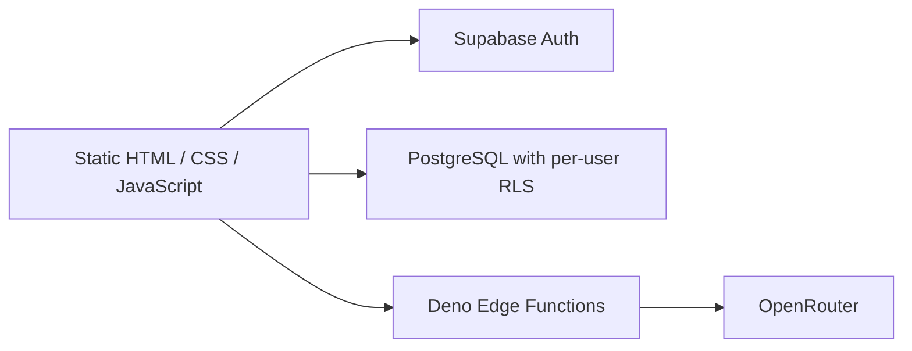

# CampusFlow

CampusFlow turns course materials into organized summaries, practice quizzes, and follow-up study conversations.

Built with JavaScript, TypeScript, Supabase Auth, PostgreSQL, Deno Edge Functions, and OpenRouter. The frontend is a static web application.

## Contents

- [Features](#features)
- [Run locally](#run-locally)
- [Architecture](#architecture)
- [Technology stack](#technology-stack)
- [Tests](#tests)
- [Technical decisions and limits](#technical-decisions-and-limits)
- [AI usage controls](#ai-usage-controls)
- [Complete setup guide](#complete-setup-guide)
- [Publishing this repository](#publishing-this-repository)

## Features

- Analyze PDF, TXT, and CSV files and group related materials by course.
- Save course summaries, schedules, and important details.
- Generate practice quizzes, persist answers, and request explanations for incorrect answers.
- Save and reopen study conversations.
- Keep saved data scoped to its owner through PostgreSQL Row Level Security policies.

Calendar is a planned feature. AI output can be inaccurate and should be checked against the source material.

## Run locally

Prerequisite: Node.js 24.20 or later in the Node 24 release line, and internet access for the browser libraries and backend.

```sh
npm start
```

Open http://localhost:5500. This serves the frontend only; it connects to the Supabase project configured in `supabase-config.js`. Use a separate development Supabase project when experimenting with saved data.

The complete backend configuration is included below. Fictional materials for manual testing are in `demo/materials`.

## Architecture



The browser submits documents and study context to Edge Functions. The functions validate inputs, request structured AI responses, and validate or repair incomplete output. The browser saves accepted results to PostgreSQL. OpenRouter credentials stay in backend environment variables.

## Technology stack

| Layer | Technologies |
| --- | --- |
| Frontend | HTML, CSS, vanilla JavaScript, Lucide icons |
| Authentication | Supabase Auth |
| Database | PostgreSQL, SQL migrations, Row Level Security |
| Backend | TypeScript, Deno-based Supabase Edge Functions |
| AI provider | OpenRouter |
| Testing | Node.js test runner, PGlite PostgreSQL integration tests, optional Playwright browser tests |
| Local server | Node.js built-in HTTP server |

### Data storage

| Table | Purpose |
| --- | --- |
| `saved_courses` | Course summaries, schedules, and important details |
| `saved_quizzes` | Generated questions and saved answers |
| `saved_conversations` | Study conversation history |
| `feedback_requests` | Visitor feedback with separate insert-only permissions |
| `ai_usage_settings` | Owner-configured rate, daily, and concurrent task limits |
| `ai_usage_accounts` | Per-user transaction locks for atomic admission |
| `ai_usage_tasks` | Accepted task counts and expiring concurrency leases |

### Project structure

```text
CampusFlow/
├── index.html
├── main.css
├── study.css
├── script.js
├── sign_in.html / sign_in.js
├── sign_up.html / sign_up.js
├── supabase-config.js
├── package.json
├── tools/serve.cjs
├── demo/materials/
├── supabase/
│   ├── functions/_shared/auth.ts
│   ├── functions/_shared/ai-controls.ts
│   ├── functions/analyze-course-file/index.ts
│   ├── functions/study-assistant/index.ts
│   └── migrations/
└── tests/
```

## Tests

```sh
npm ci
npm test
```

The automated suite contains 85 tests: the original 22 study/analysis tests, 18 authentication regressions, 28 AI-control tests, 12 SQL integration tests, and 5 user-facing error-message tests. Auth and provider responses are mocked. Quota migrations are executed in an embedded PostgreSQL engine through PGlite, covering shared limits, UTC reset, expired leases, permissions, and idempotent completion. Rejected requests are checked to ensure they never reach the AI provider. UI errors use fixed, actionable messages instead of displaying raw backend diagnostics.

PGlite uses one connection, so admission tests verify database logic and queued requests, not a distributed load test across independent production connections. Live gateway settings, multi-instance stress behavior, and real-model quality require separate deployed checks.

For deployed authentication checks, run `npm run test:auth:live`. This sends only empty-input requests and checks missing and invalid user tokens. Signed-in verification is optional through the `CAMPUSFLOW_TEST_ACCESS_TOKEN` environment variable; never commit or share that token. Alternatively, verify signed-in behavior in the application.

The browser regression suite requires Playwright and a Chromium installation:

```sh
npm install --no-save --package-lock=false playwright
npx playwright install chromium
npm run test:ui
```

The browser suite was not run during the local review. It mocks Supabase and does not write to the live project. Playwright is optional and is not included in the dependency-free backend setup.

## Technical decisions and limits

- SQL migrations define ownership policies, indexes, and basic JSON constraints.
- AI handlers validate file types, sizes, and output structure, with retry and repair behavior.
- Frontend request counters prevent stale results from overwriting newer UI state.
- Conversation persistence includes a retry-save path when database writes fail.
- Frontend state is currently concentrated in `script.js`; modularization is planned.
- Both AI handlers verify user tokens with Supabase Auth before processing inputs or calling OpenRouter. Authentication checks have an eight-second timeout and fail closed when Auth is unavailable.
- Both handlers share database-backed rate, daily, and concurrent limits, plus one provider-call/time budget that includes HTTP retries and output repair.
- Deployed gateway verification and real-provider quality benchmarks still need separate verification.

## AI usage controls

Limits apply to the verified user across both AI functions:

| Limit | Default | Configuration |
| --- | --- | --- |
| Accepted tasks in a rolling 60-second window | 6 | `ai_usage_settings.requests_per_minute` |
| Accepted tasks per UTC calendar day | 50 | `ai_usage_settings.requests_per_day` |
| Active tasks at once | 2 | `ai_usage_settings.max_concurrent` |
| Total AI generation phase, including retry delays and repair | 90 seconds | `AI_TASK_TIMEOUT_MS=90000` |
| Each provider request, including reading its response | 30 seconds | `AI_ATTEMPT_TIMEOUT_MS=30000` |
| Provider calls per task, counting retries and repair | 4 | `AI_MAX_PROVIDER_CALLS=4` |

Input validation occurs before admission. A PostgreSQL transaction locks one row per user while checking limits and reserving a slot. These locks are released when admission commits, before the provider is called. Browser roles cannot reserve/release tasks or change the settings; the backend uses its server-only `SUPABASE_SERVICE_ROLE_KEY`.

Accepted tasks count even if AI generation fails; rejected or invalid requests do not. Finishing a task frees concurrent capacity without refunding usage. If a worker or release call fails, its lease expires automatically (110 seconds with the default generation budget). A returning user's history older than two days is removed during admission; history for inactive users can be removed separately by an owner-controlled cleanup job.

Quota denials return HTTP `429`, a machine-readable reason, `Retry-After`, and `retryAfterSeconds`. The UI displays when to try again. Total AI timeout returns `504`; provider failures and an exhausted call budget return a clear error. No provider call is allowed when quota checks fail. These are request/call limits rather than a monetary billing cap.

To change quotas, use the project's SQL editor as the owner:

```sql
update public.ai_usage_settings
set requests_per_minute = 6, requests_per_day = 50, max_concurrent = 2
where id = true;
```

Generation settings are optional backend secrets. Supported ranges: task timeout 15–120 seconds, provider timeout 1–60 seconds (not greater than the task timeout), and 1–8 provider calls. Auth and quota RPCs have separate eight-second bounds; the 90-second budget covers AI generation, not document upload, authentication, or quota cleanup.


## Complete setup guide

### 1. Start the frontend

From the project directory, run `npm start` and open http://localhost:5500. Stop the server with Ctrl+C. The frontend server needs no dependencies. Run `npm ci` before tests to install the pinned development-only PostgreSQL test engine.

The server only exposes the application's public assets. It does not expose migrations, tests, environment files, or documentation.

### 2. Configure your own Supabase project

Create or select a development project. In `supabase-config.js`, replace `url` and `publishableKey` with that project's URL and browser publishable key. This configuration is public; never put service-role credentials or an OpenRouter API key here.

The current file points to an existing project. Simply starting this frontend does not create an isolated backend.

Edit only the configuration object in `supabase-config.js`, preserving the client initialization code below it:

```js
window.SUPABASE_CONFIG = {
    url: "YOUR_SUPABASE_PROJECT_URL",
    publishableKey: "YOUR_SUPABASE_PUBLISHABLE_KEY"
};
```

### 3. Create the database tables

In a new development database, apply the SQL files from `supabase/migrations` in filename order:

1. `20260924_create_saved_courses.sql`
2. `20261001_create_saved_quizzes.sql`
3. `20261004_create_saved_conversations.sql`
4. `20261005_create_feedback_requests.sql`
5. `20261006_add_ai_usage_controls.sql`

Use the Supabase SQL editor, or your established migration workflow. These files create policies as well as tables; do not blindly rerun them against a database where those policies already exist.

For an existing project, apply only the new quota migration if the original tables/policies are already installed. Apply it before deploying the updated AI handlers. The quota migration itself is repeatable and preserves existing settings and task history.

### 4. Deploy the backend functions

Deploy the source directories `supabase/functions/analyze-course-file` and `supabase/functions/study-assistant` under their matching function names using your Supabase deployment workflow.

Set these backend environment variables:

| Name | Value |
| --- | --- |
| `OPENROUTER_API_KEY` | Your provider key, stored only as a backend secret |
| `ALLOWED_ORIGIN` | `http://localhost:5500` for this local frontend |
| `CAMPUSFLOW_PUBLISHABLE_KEY` | Browser publishable key of the same Supabase project |

`SUPABASE_URL` is provided by hosted Supabase Edge Functions. For another runtime or a test harness, configure it explicitly.

The quota RPCs also require the hosted backend's `SUPABASE_SERVICE_ROLE_KEY`. Keep this credential server-side. Optional generation secrets and defaults are listed in the AI usage controls section; missing or invalid required configuration fails closed.

To update the existing hosted functions from this repository:

```sh
npm run supabase:login
npm run deploy:auth
npm run test:auth:live
```

The deployment tool targets the project configured in `supabase-config.js`, checks gateway settings and the quota RPCs' presence/denial of browser access, sets `CAMPUSFLOW_PUBLISHABLE_KEY`, and deploys only the two AI functions. It preserves each function's existing `verify_jwt` setting and stops if required checks fail. It does not apply migrations or change your provider key or CORS origin. Supabase CLI 2.119.0 is used through npm; Docker is not required for this deployment path.

For a new project without these deployed functions, use your normal deployment workflow and explicitly choose the gateway settings. Validate them with both rejected and signed-in requests.

#### Deploying through the Supabase Dashboard editor

The current `supabase/functions/*/index.ts` files are self-contained Dashboard-compatible entrypoints. They already contain authentication and AI controls and have no local imports. Either current entrypoint can be copied in full into its matching function in the Dashboard.

The `_shared/auth.ts` and `_shared/ai-controls.ts` files are retained as reusable modules. The current standalone entrypoints do not import them: editing a shared file alone does not update either deployed handler. Keep any future helper changes consistent in both entrypoints, or restore shared imports in the source and generate standalone Dashboard copies before deployment. Copying a modular entrypoint that imports `../_shared` without including those files causes the earlier `Module not found ... _shared/auth.ts` bundling error.

Generate standalone versions for the Dashboard:

```sh
npm run build:edge:dashboard
```

Copy the entire corresponding generated file into each function's Dashboard `index.ts`:

- `supabase/.temp/dashboard/study-assistant/index.ts`
- `supabase/.temp/dashboard/analyze-course-file/index.ts`

These generated files include authentication and AI controls without local imports. The builder preserves current standalone source entrypoints; it also supports source entrypoints that import the two shared modules. Keep `supabase/functions` as the source of truth and regenerate after changing the active entrypoints. Generated files are ignored by Git. Apply the quota migration and configure backend secrets before deploying, and preserve your existing gateway and CORS configuration. Then run the live checks and verify a signed-in user through the application.

The current code accepts one exact browser origin. Use a separate backend/environment for a public demo, or implement an explicit origin allowlist before using both local and hosted frontends.

Verify the configured model is available to your provider account. Both functions currently declare their model in source code.

Before inviting public users, verify deployed authentication for both functions. A request with no valid user token must be rejected before it reaches the AI provider. The handler verification is covered by unit tests; gateway settings and valid-user behavior still require checks after deployment.

### 5. Configure authentication

In Supabase Auth settings, configure the local site URL and allow the signup email redirect to `http://localhost:5500/index.html`. Complete email confirmation if enabled. Use your own development account for the walkthrough.

### 6. Verify the installation

- Run `npm ci` and `npm test`: expect 85 passing automated tests.
- Sign up, confirm the email if required, and sign in.
- Analyze the fictional files in `demo/materials`, save a course or quiz, and verify it survives reload.
- Confirm a second account cannot access the first account's saved records using a separate integration test before claiming verified tenant isolation.

### Troubleshooting

| Symptom | Check |
| --- | --- |
| Browser cannot reach the backend | Project URL, publishable key, network access |
| AI requests fail in the browser | Exact `ALLOWED_ORIGIN`, function deployment, signed-in session |
| Provider request fails | Backend key, account limits, model availability |
| Saving fails | Applied migrations, authenticated user, ownership policies |
| Signup does not open the application | Email confirmation and redirect settings |
| Local port is occupied | Stop the other process using port 5500 before restarting |

## Publishing this repository

### Files to include

Keep the following files and directories in a public source repository, preserving the directory layout:

- Public frontend: `index.html`, `sign_in.html`, `sign_up.html`, `main.css`, `study.css`, `script.js`, `sign_in.js`, `sign_up.js`, `supabase-config.js`, and `favicon.svg`.
- Project documentation and reproducible setup: `README.md`, `.gitignore`, `package.json`, and `package-lock.json`.
- All source files in `supabase/functions` and all five SQL files in `supabase/migrations`.
- All files in `tools` and `tests`.
- The three fictional TXT files in `demo/materials`.
- Optional editor configuration: `.vscode/settings.json`, which enables Deno only for the Edge Function folders.

The current frontend configuration contains a Supabase URL and a browser publishable key. These are public configuration, not backend credentials. Keep them configured for the project that will serve your public demo. Never substitute a service-role key, secret key, provider key, or login token.

### Files to exclude

Exclude `node_modules`, `supabase/.temp`, `supabase/.branches`, `.env` files containing real values, logs, test reports, and private database exports or personal course documents. The current `docs` directory is empty and can be omitted. `.gitignore` covers the generated folders and environment files; when uploading through the GitHub website, select files deliberately rather than uploading the whole working folder.

Generated Dashboard entrypoints under `supabase/.temp/dashboard` are local deployment aids. They do not belong in the public repository; the active function sources are already in `supabase/functions`.

### Moving to a new GitHub Pages repository

Back up the old repository and record its Pages settings before deleting it. Keep the existing Supabase project if you want to preserve accounts, saved data, and deployed functions.

1. Create the new repository and upload the source files listed above with `index.html` at the repository root.
2. In repository **Settings > Pages**, choose **Deploy from a branch**, the uploaded branch (usually `main`), and **/ (root)**. The empty local `docs` directory is not a publishing source.
3. Use the published URL shown by GitHub. For a project site such as `https://YOUR_USERNAME.github.io/YOUR_REPOSITORY/`, configure the Edge Function secret `ALLOWED_ORIGIN` as `https://YOUR_USERNAME.github.io` with no repository path or trailing slash. For a custom domain, use that domain's exact HTTPS origin.
4. In Supabase Auth URL Configuration, set **Site URL** to the full published application URL, and allow the exact email confirmation destination, such as `https://YOUR_USERNAME.github.io/YOUR_REPOSITORY/index.html`.
5. Uploading TypeScript and SQL to GitHub stores source code. It does not deploy Edge Functions or execute migrations. Redeploy both functions only when their active backend code needs updating; apply only missing migrations to an existing database.
6. Run `npm run test:auth:live`, then verify signup/confirmation, signed-in file analysis, quiz generation, saving and reopening records, and the generic error messages on the new website. The empty-input live check does not confirm valid-user AI generation or ownership isolation.
7. Update your repository About/Website field and resume links to the new repository and live application.

The existing relative frontend asset links and signup redirect calculation support a repository subpath. Localhost references in the local server and local setup instructions do not redirect the public website to your machine. The current CORS code permits only one exact origin; configuring the hosted origin may intentionally prevent local AI requests to the same backend.

### Remaining manual checks

- Confirm the currently deployed function source matches the active source files and backend secrets are configured. Rejection of invalid tokens alone cannot prove that the deployed version contains the latest quota logic.
- Verify saving and record ownership with two signed-in test accounts. Anonymous permission checks do not verify isolation between authenticated users.
- Run the optional Playwright UI suite or complete a browser walkthrough, including a narrow mobile viewport. Automated backend tests mock the provider and do not establish real-model answer quality.
- The Sign In page's **Forgot Password?** link is currently a placeholder. Implement recovery or remove the link before presenting it as a working feature. Calendar is explicitly marked as planned.
- Frontend CDN URLs currently track Supabase's major version and Lucide's latest release. Pin specific verified versions when making dependency updates reproducible.

